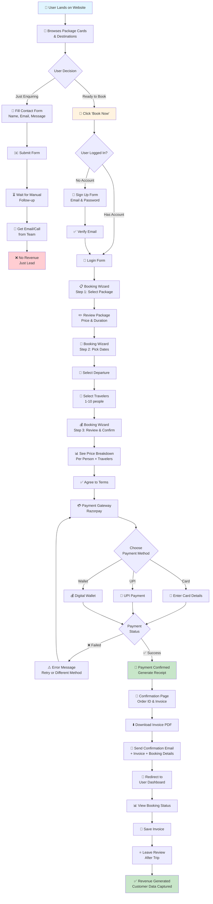
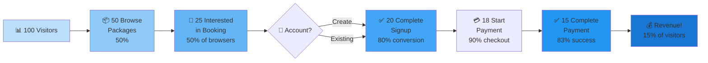
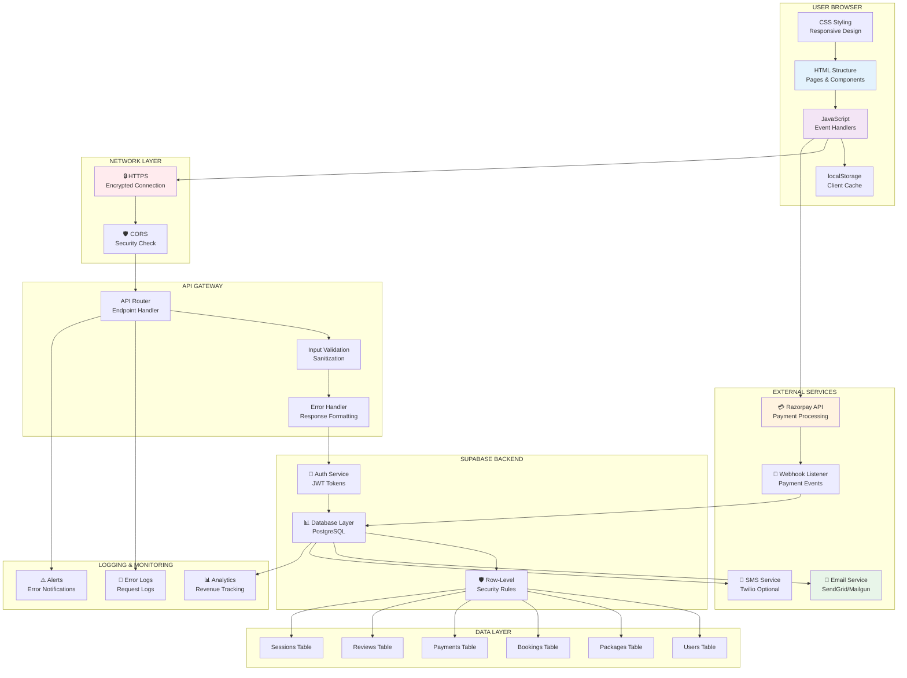
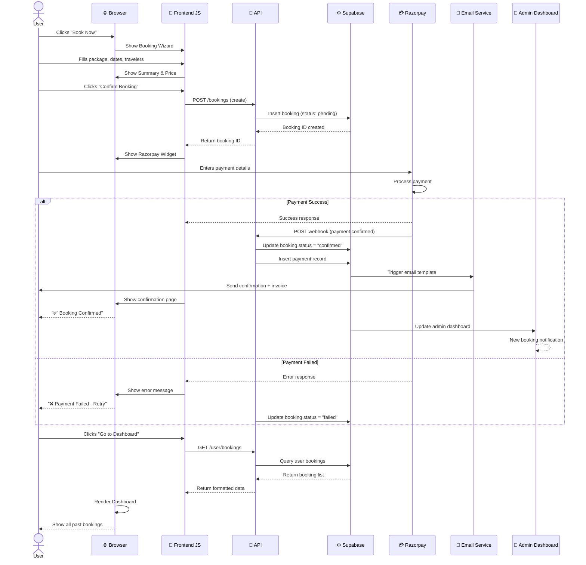

# NL Travo Expeditions - User Flow & System Architecture
## Technical Proposal for MVP Development

---

## 1. USER JOURNEY FLOW

### Main User Path: From Landing → Booking → Payment → Confirmation

```
┌─────────────────────────────────────────────────────────────────┐
│                     USER LANDING PAGE                           │
│  (Hero Section, Services, Packages, Destinations)               │
└─────────────────────────────────────────────────────────────────┘
                            ↓
                    User scrolls down
                            ↓
         ┌───────────────────────────────────────┐
         │   What Users See & Can Do:            │
         │                                       │
         │  1. Browse 4 Package Cards            │
         │     - Price: ₹15k-₹35k                │
         │     - Duration: 2-7 days              │
         │     - Ratings: 4-5 stars              │
         │                                       │
         │  2. View 6 Destinations               │
         │     - Photos, names, descriptions     │
         │                                       │
         │  3. Contact Form (Lead Capture)       │
         │     - Name, email, phone, message     │
         │     - Current: Form only (offline)    │
         └───────────────────────────────────────┘
                            ↓
               ┌────────────┴────────────┐
               ↓                         ↓
        USER WANTS TO:              USER WANTS TO:
        ENQUIRE (Lead)              BOOK NOW (Transaction)
               ↓                         ↓
        Fill Contact Form        [THIS IS MISSING]
        (Current Flow)           (Need to build)
               ↓                         ↓
        Submit                   Click "Book Now"
               ↓                         ↓
        Manual follow-up          Redirect to:
        via email/phone           Booking Wizard
                                       ↓
                                [Step 1] Select Package
                                  - Choose destination
                                  - Confirm price
                                       ↓
                                [Step 2] Pick Dates
                                  - Departure date
                                  - Number of travelers
                                       ↓
                                [Step 3] Review & Pay
                                  - Summary of booking
                                  - Price breakdown
                                  - Terms agreement
                                       ↓
                                [Decision Point]
                                Has User Account?
                                  ├─ NO → Sign Up
                                  └─ YES → Go to Payment
                                       ↓
                                [Login/Signup Form]
                                  - Email/Password
                                  - Email verification
                                       ↓
                                [Payment Gateway]
                                  - Razorpay form
                                  - Card/UPI/Wallet
                                       ↓
                                [Payment Processing]
                                  ├─ SUCCESS → ✓
                                  └─ FAILED → Retry
                                       ↓
                                [Confirmation Page]
                                  - Order ID
                                  - Invoice download
                                  - Booking details
                                       ↓
                            [Email Confirmation]
                            - Booking receipt
                            - Payment receipt
                            - Trip details
                                       ↓
                            [User Dashboard]
                            - View past bookings
                            - Download invoice
                            - Track trip status
```

---

## 2. DETAILED USER FLOW - MERMAID DIAGRAM



---

## 3. SYSTEM ARCHITECTURE DIAGRAM

```mermaid
graph TB
    subgraph "Client Side - Frontend"
        WEB["🌐 NL Travo Website<br/>HTML/CSS/JavaScript"]
        LOCAL["💾 localStorage<br/>Cart, User Prefs"]
    end
    
    subgraph "Frontend Features"
        NAV["Navigation<br/>Home, Services, Packages"]
        PACKAGES["Package Cards<br/>4 Destinations"]
        DEST["Destination Gallery<br/>6 Locations"]
        CONTACT["Contact Form<br/>Lead Capture"]
        BOOKING["Booking Wizard<br/>3-Step Flow"]
        AUTH["Auth Forms<br/>Login/Signup"]
        PAYMENT["Razorpay Widget<br/>Payment UI"]
        DASHBOARD["User Dashboard<br/>Bookings & Invoice"]
    end
    
    subgraph "API Communication"
        API["REST API<br/>Fetch Requests"]
    end
    
    subgraph "Server Side - Backend (Supabase)"
        SUPERBASE["⚙️ Supabase Backend<br/>PostgreSQL + Auth + Realtime"]
        
        subgraph "Database Tables"
            USERS["👥 Users Table<br/>ID, Email, Name, Phone"]
            PACKAGES_DB["📦 Packages Table<br/>Name, Price, Duration"]
            BOOKINGS["🛒 Bookings Table<br/>User, Package, Date, Status"]
            PAYMENTS["💳 Payments Table<br/>Booking, Amount, Status"]
            REVIEWS["⭐ Reviews Table<br/>Rating, Comment, User"]
        end
        
        subgraph "Backend Logic"
            AUTH_LOGIC["🔐 Auth Logic<br/>Sign up, Login, JWT"]
            BOOKING_LOGIC["📋 Booking Logic<br/>Create, Validate, Store"]
            PAYMENT_LOGIC["💰 Payment Logic<br/>Process, Verify, Store"]
            EMAIL_LOGIC["📧 Email Logic<br/>Send Confirmations"]
        end
    end
    
    subgraph "Third-Party Services"
        RAZORPAY["💳 Razorpay<br/>Payment Gateway"]
        EMAIL["📨 Email Service<br/>Supabase Mail/SendGrid"]
        WEBHOOK["🔗 Webhooks<br/>Payment Notifications"]
    end
    
    subgraph "Data Flows"
        F1["1️⃣ User Browse<br/>(Read Data)"]
        F2["2️⃣ User Signup<br/>(Create User)"]
        F3["3️⃣ Create Booking<br/>(Insert Booking)"]
        F4["4️⃣ Process Payment<br/>(Razorpay)"]
        F5["5️⃣ Confirm Booking<br/>(Update Status)"]
        F6["6️⃣ Send Email<br/>(Notify User)"]
    end
    
    %% Frontend connections
    WEB --> NAV
    WEB --> PACKAGES
    WEB --> DEST
    WEB --> CONTACT
    WEB --> BOOKING
    WEB --> AUTH
    WEB --> PAYMENT
    WEB --> DASHBOARD
    WEB --> LOCAL
    
    %% Frontend to API
    NAV --> API
    PACKAGES --> API
    CONTACT --> API
    BOOKING --> API
    AUTH --> API
    PAYMENT --> API
    DASHBOARD --> API
    
    %% API to Backend
    API --> SUPERBASE
    
    %% Backend components
    SUPERBASE --> USERS
    SUPERBASE --> PACKAGES_DB
    SUPERBASE --> BOOKINGS
    SUPERBASE --> PAYMENTS
    SUPERBASE --> REVIEWS
    
    SUPERBASE --> AUTH_LOGIC
    SUPERBASE --> BOOKING_LOGIC
    SUPERBASE --> PAYMENT_LOGIC
    SUPERBASE --> EMAIL_LOGIC
    
    %% Third-party integrations
    PAYMENT_LOGIC --> RAZORPAY
    EMAIL_LOGIC --> EMAIL
    RAZORPAY --> WEBHOOK
    WEBHOOK --> PAYMENT_LOGIC
    
    %% Data flows
    F1 -.->|GET /packages| PACKAGES_DB
    F2 -.->|POST /auth/signup| USERS
    F3 -.->|POST /bookings| BOOKINGS
    F4 -.->|POST /payments| RAZORPAY
    F5 -.->|PUT /bookings/:id| BOOKINGS
    F6 -.->|Email Template| EMAIL
    
    style WEB fill:#e3f2fd
    style SUPERBASE fill:#f3e5f5
    style RAZORPAY fill:#fff3e0
    style EMAIL fill:#e8f5e9
    style BOOKING fill:#fff9c4
```



---

## 4. USER FLOW - CONVERSION FUNNEL



---

## 5. DETAILED FEATURE BREAKDOWN BY USER FLOW STAGE

### Stage 1: Landing & Browsing (No Authentication Needed)
```
┌─────────────────────────────────────────┐
│ WHAT USER SEES & DOES:                  │
│                                         │
│ ✓ Hero section with CTA button          │
│ ✓ Browse services (4 cards)             │
│ ✓ View packages (4 price cards)         │
│ ✓ Explore destinations (6 photos)       │
│ ✓ Read testimonials/reviews             │
│ ✓ See pricing clearly                   │
│                                         │
│ ACTION: Click "Book Now" OR             │
│         "Contact Us"                    │
└─────────────────────────────────────────┘
```

### Stage 2: Authentication (New Feature)
```
┌─────────────────────────────────────────┐
│ WHAT HAPPENS:                           │
│                                         │
│ User not logged in                      │
│         ↓                               │
│ Modal/Page appears: "Sign Up / Login"   │
│         ↓                               │
│ NEW USER:                               │
│ • Enter Email                           │
│ • Create Password                       │
│ • Verify Email (link sent)              │
│ • Auto-login after verification         │
│         ↓                               │
│ EXISTING USER:                          │
│ • Enter Email                           │
│ • Enter Password                        │
│ • Forgot Password? (Reset link)         │
│ • Success → Dashboard                   │
└─────────────────────────────────────────┘
```

### Stage 3: Booking Wizard (New Feature)
```
┌──────────────────────────────────────────────┐
│ STEP 1: SELECT PACKAGE                       │
├──────────────────────────────────────────────┤
│ Radio buttons for:                           │
│ • Leh Ladakh (₹15,000, 5 days)              │
│ • Kashmir (₹12,000, 4 days)                 │
│ • Goa (₹8,000, 3 days)                      │
│ • Bike Tour (₹20,000, 7 days)               │
│                                              │
│ ✓ Price updates dynamically                 │
│ ✓ Description shows                         │
│ ✓ Next button enables after selection       │
└──────────────────────────────────────────────┘
                    ↓
┌──────────────────────────────────────────────┐
│ STEP 2: PICK DATES & TRAVELERS              │
├──────────────────────────────────────────────┤
│ • Date Picker: Select departure date        │
│   (Min: Tomorrow, Max: 90 days ahead)       │
│                                              │
│ • Traveler Count: 1-10 people               │
│   (Buttons: - | Count | +)                 │
│                                              │
│ ✓ Availability checked in real-time         │
│ ✓ Can't book if sold out                    │
│ ✓ Previous/Next buttons visible             │
└──────────────────────────────────────────────┘
                    ↓
┌──────────────────────────────────────────────┐
│ STEP 3: REVIEW & CONFIRM                    │
├──────────────────────────────────────────────┤
│ Summary Shows:                               │
│ • Package: Leh Ladakh Adventure             │
│ • Duration: 5 days                          │
│ • Departure: Jan 15, 2025                   │
│ • Travelers: 3 people                       │
│                                              │
│ Price Breakdown:                             │
│ • Price/Person: ₹15,000                     │
│ • Travelers: × 3                            │
│ • Subtotal: ₹45,000                         │
│ • Tax (GST): ₹8,100 (18%)                   │
│ • TOTAL: ₹53,100                            │
│                                              │
│ ☑ I agree to terms & cancellation policy    │
│                                              │
│ [Confirm Booking] → Payment Gateway         │
└──────────────────────────────────────────────┘
```

### Stage 4: Payment Processing (New Feature)
```
┌──────────────────────────────────────────────┐
│ RAZORPAY PAYMENT FORM APPEARS                │
├──────────────────────────────────────────────┤
│ Amount: ₹53,100                              │
│                                              │
│ Payment Method Options:                      │
│ ☐ Card (Debit/Credit)                       │
│ ☐ UPI (Google Pay, Paytm, PhonePe)         │
│ ☐ Net Banking                               │
│ ☐ Wallet                                    │
│                                              │
│ User selects method, enters details         │
│         ↓                                   │
│ Razorpay processes securely                 │
│         ↓                                   │
│ WEBHOOK: Razorpay → Backend                 │
│         ↓                                   │
│ Backend updates Booking: "CONFIRMED"        │
│ Backend updates Payment: "SUCCESS"          │
│         ↓                                   │
│ Email sent to user with:                    │
│ • Order ID                                  │
│ • Invoice PDF                               │
│ • Booking Details                           │
│ • Support Contact                           │
└──────────────────────────────────────────────┘
```

### Stage 5: Confirmation & Dashboard (New Feature)
```
┌──────────────────────────────────────────────┐
│ CONFIRMATION PAGE SHOWS:                     │
├──────────────────────────────────────────────┤
│ ✅ Booking Confirmed!                       │
│ Order ID: #BOOKING-2025-001234              │
│                                              │
│ Booking Details:                             │
│ • Package: Leh Ladakh Adventure             │
│ • Dates: Jan 15-20, 2025                    │
│ • Travelers: 3 people                       │
│ • Total Paid: ₹53,100                       │
│                                              │
│ Actions Available:                           │
│ [⬇️ Download Invoice] [📧 Send to Email]    │
│ [🔍 View Details] [👤 Go to Dashboard]      │
└──────────────────────────────────────────────┘
                    ↓
┌──────────────────────────────────────────────┐
│ USER DASHBOARD SHOWS:                        │
├──────────────────────────────────────────────┤
│ Welcome, David!                              │
│                                              │
│ MY BOOKINGS:                                 │
│ ┌────────────────────────────────────┐      │
│ │ Leh Ladakh Adventure               │      │
│ │ Jan 15-20, 2025 | 3 travelers      │      │
│ │ Status: Confirmed ✅               │      │
│ │ Amount: ₹53,100 | Paid ✅          │      │
│ │ [View Details] [Cancel] [Review]   │      │
│ └────────────────────────────────────┘      │
│                                              │
│ MY PROFILE:                                  │
│ • Name: David Kumar                         │
│ • Email: david@example.com                  │
│ • Phone: +91 98765 43210                    │
│ [Edit Profile] [Change Password]            │
│                                              │
│ MY INVOICES:                                 │
│ • Invoice #2025-001234 [⬇️ Download]       │
└──────────────────────────────────────────────┘
```

---

## 6. SYSTEM ARCHITECTURE - COMPONENT INTERACTION



---

## 7. DATA FLOW - FROM CLICK TO CONFIRMATION



---

## 8. MONTHLY USER FLOW - EXPECTED CONVERSION METRICS

```
VISITOR ANALYTICS (Assuming 1,000 monthly visitors):

Landing Page
    ↓
100% (1,000) - Land on home page
    ↓
70% (700) - Scroll down to packages
    ↓
50% (500) - View package details
    ↓
30% (300) - Interested (click book now or contact)
    ├─ Contact Form (old way): 200 people
    │   └─ Conversion: ~5% = 10 customers
    │   └─ Revenue: 10 × ₹25,000 = ₹2,50,000
    │
    └─ Booking Wizard (new way): 100 people
        ├─ Signup completion: 85% = 85 users
        │
        ├─ Checkout started: 90% = 76.5 people
        │
        ├─ Payment success: 85% = 65 people
        │
        └─ Revenue: 65 × ₹25,000 = ₹16,25,000

OLD SYSTEM (Contact Form Only):
├─ Conversion: ~5%
├─ Revenue: ₹2,50,000/month
└─ Time to sale: 2-5 days

NEW SYSTEM (Booking Wizard + Contact Form):
├─ Conversion: ~6.5%
├─ Revenue: ₹18,75,000/month (7.5x better)
└─ Time to sale: Instant (automated)

IMPROVEMENT: +₹16,25,000/month extra revenue with same traffic!
```

---

## 9. IMPLEMENTATION ROADMAP - USER FEATURE RELEASES

### Release 1 (Week 1-2): Core Booking
```
✅ User Authentication (Signup/Login)
✅ Booking Wizard (3 steps)
✅ Razorpay Integration
✅ Order Confirmation
✅ Basic Email Notifications
```

### Release 2 (Week 3): Dashboard & Experience
```
✅ User Dashboard (View Bookings)
✅ Invoice Download
✅ Booking Cancellation
✅ Status Tracking
✅ Email Reminders
```

### Release 3 (Week 4): Reviews & Social Proof
```
✅ Post-Trip Reviews
✅ Star Ratings
✅ Photo Uploads
✅ Testimonials Display
```

---

## 10. USER STORY EXAMPLES (For Development)

```
US-1: User Authentication
  As a first-time visitor,
  I want to create an account with email/password,
  So that I can make bookings and track trips.
  
  Acceptance Criteria:
  ✓ Signup form validates email format
  ✓ Password must be 8+ chars
  ✓ Email verification required
  ✓ Auto-login after verification
  ✓ Forgot password link works

US-2: Package Selection
  As a user making a booking,
  I want to easily select a package,
  So that I can see pricing and availability.
  
  Acceptance Criteria:
  ✓ 4 packages displayed
  ✓ Price shown clearly
  ✓ Duration displayed
  ✓ Can't proceed without selecting
  ✓ Selected package highlighted

US-3: Payment Processing
  As a user completing booking,
  I want to pay securely via Razorpay,
  So that my booking is confirmed instantly.
  
  Acceptance Criteria:
  ✓ Multiple payment methods (Card, UPI, Wallet)
  ✓ Secure encryption (no CC stored)
  ✓ Instant confirmation
  ✓ Email receipt sent
  ✓ Retry on failure

US-4: Booking Dashboard
  As a returning user,
  I want to see all my bookings in one place,
  So that I can track my trips.
  
  Acceptance Criteria:
  ✓ Shows past & upcoming bookings
  ✓ Display booking status
  ✓ Download invoice option
  ✓ Cancel booking (within 7 days)
  ✓ View trip details
```

---

## 11. CLIENT PITCH - WHAT TO TELL BUSINESS OWNERS

```
📊 BEFORE vs AFTER COMPARISON:

BEFORE (Current State):
├─ Website is a brochure
├─ Contact form only (offline)
├─ Manual follow-up needed
├─ Unknown conversion rate
├─ No revenue tracking
├─ Customer data scattered
└─ Time to sale: 2-5 days

AFTER (With This Architecture):
├─ Website is a booking platform
├─ Instant booking & payment
├─ Automatic confirmations
├─ 6.5% expected conversion
├─ Real-time revenue dashboard
├─ Centralized customer database
├─ Time to sale: Instant
├─ 24/7 bookings (no manual work)
├─ Scalable to 1000+ monthly bookings
└─ Professional mobile app ready

💰 BUSINESS IMPACT:
├─ Same website, 7.5x more revenue
├─ Passive income stream (works while you sleep)
├─ Reduced manual workload
├─ Data insights for marketing
├─ Professional brand image
└─ Ready to scale nationally/globally

🎯 TARGET METRICS TO TRACK:
├─ Monthly Bookings
├─ Revenue/Month
├─ Customer Satisfaction (Reviews)
├─ Repeat Booking Rate
├─ Cost per Acquisition
└─ Net Promoter Score (NPS)
```

---

## CONCLUSION

This user flow and architecture provides:

✅ **Clear User Journey** - What users see and do at each step
✅ **Conversion Funnel** - Expected drop-off rates
✅ **System Architecture** - How all components interact
✅ **Data Flow** - Real-time from booking to confirmation
✅ **Revenue Model** - Instant payment capture
✅ **Scalability** - Built for growth

**Ready to present to clients and start development!**

